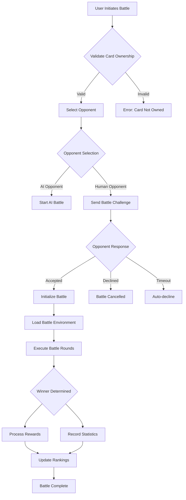
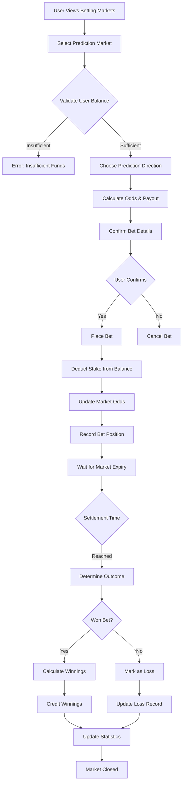
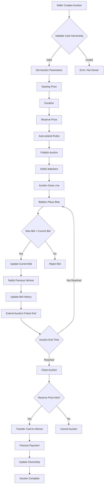
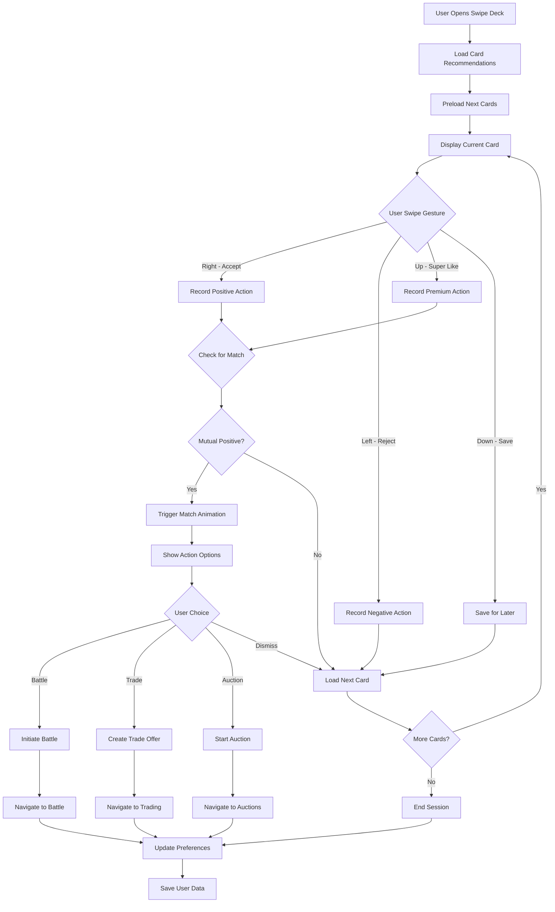
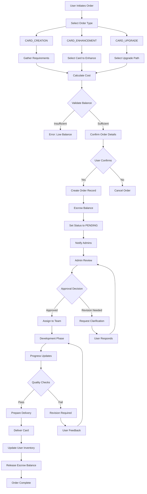
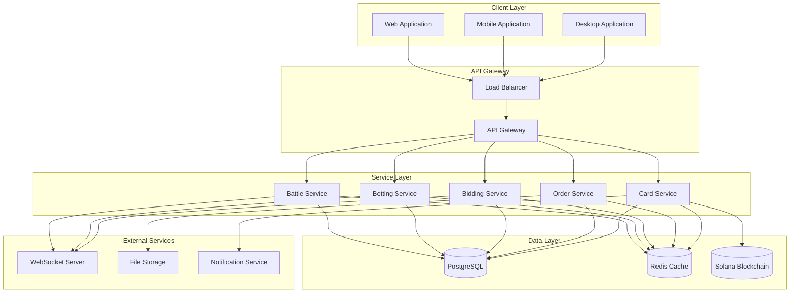
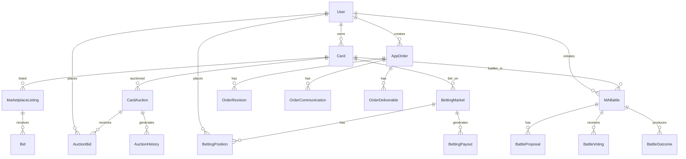
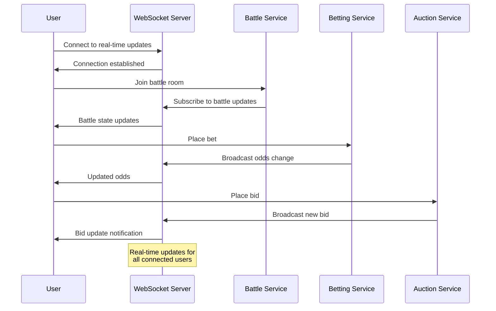
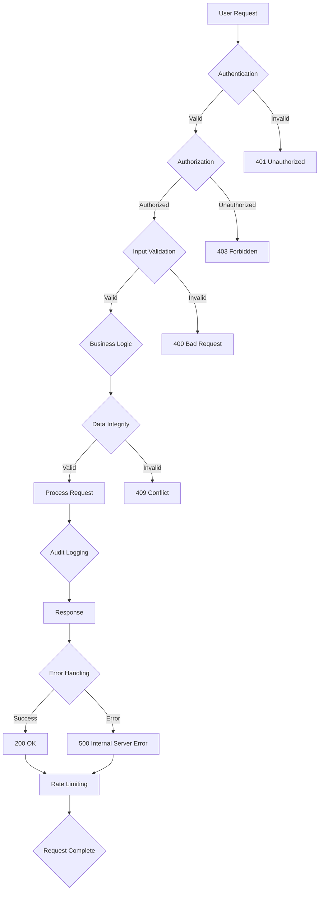

# B&B&B System Architecture Diagrams

## Battle System Flow

## Betting System Flow

## Bidding System Flow

## Tinder Swipe Deck Flow

## Order Creation and Fulfillment Flow

## System Architecture Overview

## Database Schema Relationships

## Real-time Communication Flow

## Security Architecture

