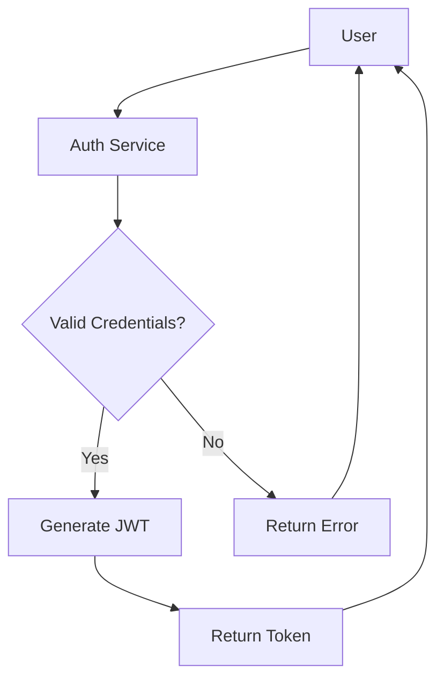
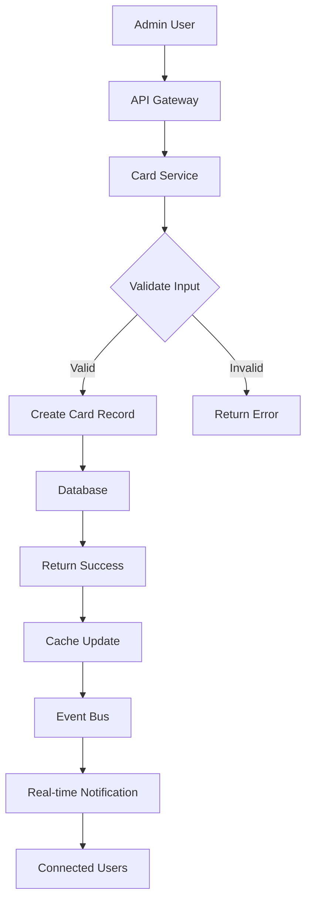
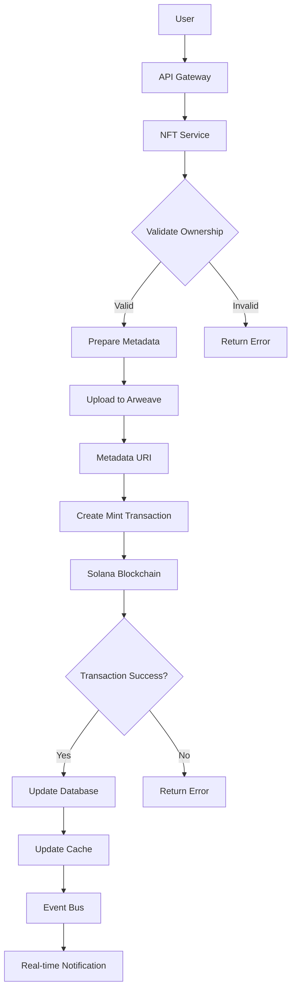
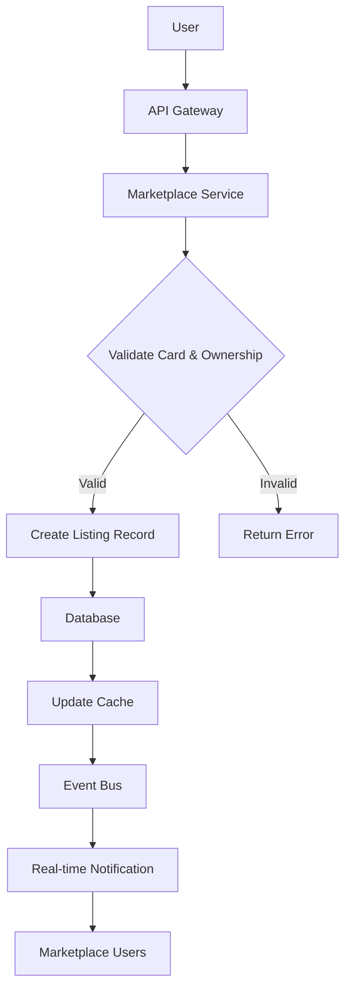
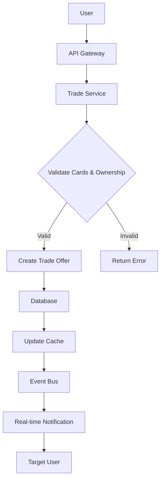
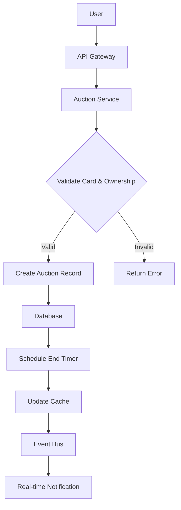
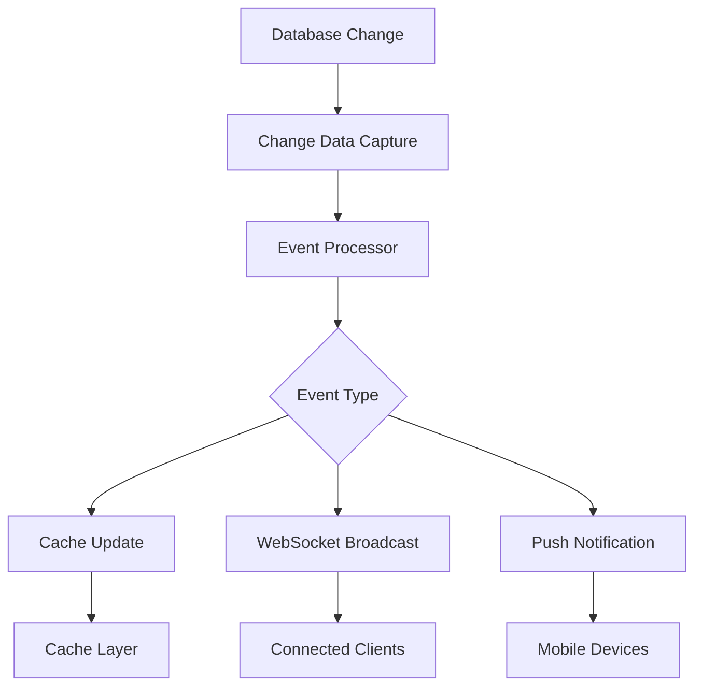

# ECE Platform - Data Flow Architecture

## Overview

This document details the data flow architecture for the ECE (Elite Card Exchange) platform, covering how data moves through the system from user interactions to database storage, blockchain operations, and real-time updates. The architecture is designed to ensure efficient, secure, and consistent data handling across all platform components.

## Data Flow Principles

### 1. Consistency
- **ACID Compliance**: Database transactions maintain atomicity, consistency, isolation, and durability
- **Eventual Consistency**: Distributed systems maintain eventual consistency where appropriate
- **Data Synchronization**: Regular synchronization between database and blockchain states

### 2. Security
- **Encryption**: Data encryption at rest and in transit
- **Access Control**: Role-based and attribute-based access control for all data flows
- **Audit Trails**: Comprehensive logging of all data access and modifications

### 3. Performance
- **Caching**: Multi-layer caching to reduce database load
- **Asynchronous Processing**: Non-blocking operations for improved responsiveness
- **Load Distribution**: Even distribution of data processing across services

### 4. Reliability
- **Error Handling**: Comprehensive error handling and recovery mechanisms
- **Retry Logic**: Automatic retry of failed operations with exponential backoff
- **Data Backup**: Regular backups and disaster recovery procedures

## Core Data Flow Patterns

### User Authentication Flow

1. User submits login credentials to Authentication Service
2. Auth Service validates credentials against User Database
3. If valid, Auth Service generates JWT token with user claims
4. JWT token is returned to user for subsequent API requests
5. If invalid, error response is returned

### Card Creation Flow

1. Admin user sends card creation request through API Gateway
2. Card Service validates input data
3. If valid, Card Service creates new card record in Database
4. Database confirms creation
5. Cache is updated with new card data
6. Event is published to Event Bus
7. Real-time notification is sent to connected users

### NFT Minting Flow

1. User requests NFT minting through API Gateway
2. NFT Service validates user ownership of card
3. If valid, metadata is prepared and uploaded to Arweave
4. Mint transaction is created with metadata URI
5. Transaction is submitted to Solana Blockchain
6. If successful, Database is updated with NFT information
7. Cache is updated with new NFT data
8. Event is published to Event Bus
9. Real-time notification is sent to connected users

### Marketplace Listing Flow

1. User submits marketplace listing request through API Gateway
2. Marketplace Service validates card and ownership
3. If valid, listing record is created in Database
4. Cache is updated with new listing data
5. Event is published to Event Bus
6. Real-time notification is sent to marketplace users

### Trade Offer Flow

1. User submits trade offer through API Gateway
2. Trade Service validates cards and ownership
3. If valid, trade offer is created in Database
4. Cache is updated with new trade offer data
5. Event is published to Event Bus
6. Real-time notification is sent to target user

### Auction Creation Flow

1. User submits auction creation request through API Gateway
2. Auction Service validates card and ownership
3. If valid, auction record is created in Database
4. End timer is scheduled for auction completion
5. Cache is updated with new auction data
6. Event is published to Event Bus
7. Real-time notification is sent to connected users

### Real-time Data Updates

1. Database change triggers Change Data Capture mechanism
2. Event Processor receives change event
3. Event is categorized by type
4. Cache is updated with new data
5. WebSocket message is broadcast to connected clients
6. Push notification is sent to mobile devices (if applicable)

## Data Storage Architecture

### Primary Database (PostgreSQL)

#### User Data
- **Users Table**: User profiles, authentication information, preferences
- **Sessions Table**: Active user sessions for security
- **Wallets Table**: Connected wallet information and addresses

#### Card Data
- **Cards Table**: Card metadata, attributes, ownership information
- **Card History Table**: Ownership transfer history
- **Card Valuations Table**: Historical value data for analytics

#### Marketplace Data
- **Listings Table**: Active marketplace listings
- **Transactions Table**: Completed marketplace transactions
- **Offers Table**: Trade offers between users

#### Auction Data
- **Auctions Table**: Active auctions
- **Bids Table**: Auction bids
- **Auction Results Table**: Completed auction results

#### NFT Data
- **NFTs Table**: NFT metadata and blockchain information
- **NFT Transactions Table**: NFT transfer history
- **Metadata Table**: Off-chain metadata storage references

### Caching Layer (Redis)

#### Hot Data
- **User Sessions**: Frequently accessed session data
- **Card Metadata**: Frequently accessed card information
- **Marketplace Listings**: Active listings for quick retrieval
- **Leaderboards**: User rankings and statistics

#### Real-time Data
- **Active Auctions**: Current auction states
- **User Portfolios**: Cached portfolio values
- **Notification Queues**: Pending notifications

### Blockchain Storage (Solana)

#### NFT Data
- **Mint Accounts**: NFT mint accounts with metadata
- **Token Accounts**: User token ownership records
- **Metadata Accounts**: NFT metadata stored on-chain

#### Transaction History
- **Transaction Logs**: All NFT-related transactions
- **Ownership Transfers**: Record of all ownership changes
- **Metadata Updates**: History of metadata changes

## Data Flow Security

### Data Encryption

#### At Rest
- **Database Encryption**: Transparent data encryption for PostgreSQL
- **File Encryption**: AES-256 encryption for uploaded files
- **Key Management**: Hardware Security Modules for key storage

#### In Transit
- **API Communication**: TLS 1.3 encryption for all API calls
- **Database Connections**: Encrypted connections to PostgreSQL
- **Blockchain Communication**: Secure RPC endpoints for Solana

### Access Control

#### Authentication
- **JWT Tokens**: JSON Web Tokens for API authentication
- **OAuth 2.0**: Integration with social login providers
- **Wallet Signatures**: Blockchain-based authentication

#### Authorization
- **Role-Based Access**: Permissions based on user roles
- **Attribute-Based Access**: Context-aware access controls
- **Resource-Based Access**: Fine-grained control over resources

### Audit Logging

#### User Actions
- **Authentication Events**: Login, logout, and failed attempts
- **Data Modifications**: Creation, update, and deletion of records
- **Financial Transactions**: All monetary transactions

#### System Events
- **Security Events**: Suspicious activities and security breaches
- **System Changes**: Configuration changes and updates
- **Performance Events**: System performance and errors

## Data Processing Pipelines

### Batch Processing

#### Data Analytics
- **Daily Aggregations**: Daily statistics and metrics
- **User Behavior Analysis**: Analysis of user interactions
- **Market Trends**: Analysis of marketplace trends

#### Report Generation
- **User Reports**: Periodic user activity reports
- **Financial Reports**: Revenue and transaction reports
- **System Reports**: System performance and health reports

### Stream Processing

#### Real-time Analytics
- **User Activity**: Real-time tracking of user actions
- **Market Activity**: Real-time tracking of marketplace activity
- **System Metrics**: Real-time system performance metrics

#### Event Processing
- **Notification Processing**: Real-time notification delivery
- **Audit Logging**: Real-time audit event processing
- **Data Synchronization**: Real-time data synchronization

## Data Flow Monitoring

### Performance Metrics

#### Latency
- **API Response Time**: Time to process API requests
- **Database Query Time**: Time to execute database queries
- **Blockchain Transaction Time**: Time to confirm blockchain transactions

#### Throughput
- **Requests Per Second**: Number of API requests per second
- **Database Operations**: Number of database operations per second
- **Blockchain Operations**: Number of blockchain operations per second

#### Error Rates
- **API Error Rate**: Percentage of failed API requests
- **Database Error Rate**: Percentage of failed database operations
- **Blockchain Error Rate**: Percentage of failed blockchain operations

### Data Quality

#### Consistency
- **Data Integrity**: Verification of data consistency
- **Referential Integrity**: Verification of foreign key relationships
- **Business Rule Compliance**: Verification of business rules

#### Completeness
- **Data Coverage**: Percentage of required data fields populated
- **Record Completeness**: Percentage of complete records
- **Historical Data**: Availability of historical data

## Data Flow Optimization

### Caching Strategies

#### Multi-level Caching
- **Browser Caching**: Client-side caching of static assets
- **CDN Caching**: Edge caching of frequently accessed data
- **Application Caching**: Server-side caching with Redis
- **Database Caching**: Query result caching

#### Cache Invalidation
- **Time-based Invalidation**: Automatic expiration of cached data
- **Event-based Invalidation**: Invalidation based on data changes
- **Manual Invalidation**: Manual cache clearing when needed

### Database Optimization

#### Query Optimization
- **Indexing Strategy**: Proper indexing for frequently queried fields
- **Query Rewriting**: Optimization of complex queries
- **Connection Pooling**: Efficient database connection management

#### Schema Optimization
- **Normalization**: Proper database normalization
- **Denormalization**: Strategic denormalization for performance
- **Partitioning**: Partitioning of large tables

### Network Optimization

#### Data Compression
- **API Response Compression**: Gzip compression for API responses
- **File Compression**: Compression of uploaded and downloaded files
- **Database Compression**: Compression of database storage

#### Connection Management
- **Connection Pooling**: Efficient management of network connections
- **Keep-Alive**: Reuse of network connections
- **Load Balancing**: Distribution of network traffic

## Conclusion

The ECE platform's data flow architecture provides a robust foundation for handling data movement throughout the system while ensuring security, performance, and reliability. The architecture is designed to support the unique requirements of a blockchain-integrated digital asset marketplace, including real-time updates, NFT operations, and high-concurrency scenarios.

The combination of multiple data flow patterns, secure storage architecture, comprehensive monitoring, and optimization strategies ensures that data is handled efficiently and securely across all platform components. The modular design allows for independent scaling of different data flows as needed.

As the platform implements Batch 4 features with advanced marketplace capabilities, the data flow architecture will be extended to handle new requirements while maintaining the high standards established for existing functionality. The design principles and patterns established provide a solid foundation for future growth and evolution.
