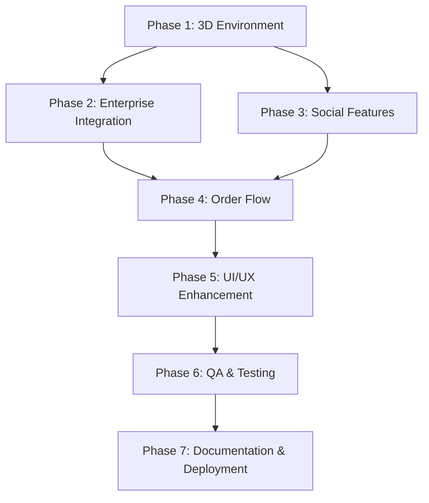

# BATCH 2: Implementation Strategy & Architecture
## Technical Implementation Plan
## Date: July 26, 2025

---

## 🏗️ **TECHNICAL ARCHITECTURE OVERVIEW**

### **Development Phases & Dependencies**



---

## 🎯 **PRIORITY MATRIX**

### **Critical Path Items (Must Complete First)**
1. **3D Token Model & Visualization** - Foundational for user experience
2. **App Generation Pipeline Review** - Core business functionality
3. **Order Flow Linearization** - Essential for user conversion
4. **Enterprise SSO Implementation** - Blocking enterprise sales
5. **Security & Compliance Framework** - Required for production

### **Parallel Development Streams**
- **Stream A**: 3D Development Team (Phase 1)
- **Stream B**: Backend Team (Phase 2 + 4)
- **Stream C**: Social Features Team (Phase 3)
- **Stream D**: QA & Testing Team (Phase 6 - ongoing)

---

## 🔧 **TECHNICAL IMPLEMENTATION DETAILS**

### **Phase 1: 3D Environment Implementation**

#### **Three.js Integration Stack**
```typescript
// Required Libraries & Versions
"three": "^0.155.0"
"@react-three/fiber": "^8.13.0"
"@react-three/drei": "^9.78.0"
"@react-three/postprocessing": "^2.15.0"
"@react-three/cannon": "^6.5.2" // Physics
```

#### **3D Component Architecture**
```typescript
// Core 3D Components
📁 /components/3d/
  ├── core/
  │   ├── Scene.tsx              // Main 3D scene wrapper
  │   ├── Camera.tsx             // Camera controls
  │   ├── Lighting.tsx           // Lighting setup
  │   └── Performance.tsx        // Performance monitoring
  ├── models/
  │   ├── ECEToken.tsx           // 3D ECE token model
  │   ├── TradingCard.tsx        // 3D trading card model
  │   └── Environment.tsx        // 3D environment assets
  ├── effects/
  │   ├── Holographic.tsx        // Holographic effects
  │   ├── Particles.tsx          // Particle systems
  │   └── PostProcessing.tsx     // Visual effects
  └── ui/
      ├── Scene3D.tsx            // 3D scene container
      ├── ModelViewer.tsx        // Model viewer component
      └── VRSupport.tsx          // VR/AR support
```

#### **Performance Optimization Strategy**
- **LOD (Level of Detail)**: Multiple model resolutions based on distance
- **Instancing**: Efficient rendering of multiple similar objects
- **Culling**: Frustum and occlusion culling for performance
- **Compression**: DRACO geometry compression for smaller files
- **Progressive Loading**: Load low-res first, then high-res

### **Phase 2: Enterprise Integration Architecture**

#### **SSO Implementation Stack**
```typescript
// Required Libraries
"@auth0/nextjs-auth0": "^3.0.0"
"passport": "^0.6.0"
"passport-saml": "^3.2.0"
"node-saml": "^4.0.0"
"openid-client": "^5.4.0"
```

#### **Enterprise API Gateway**
```typescript
📁 /api/enterprise/
  ├── auth/
  │   ├── saml/[...provider].ts    // SAML endpoints
  │   ├── oauth/[...provider].ts   // OAuth endpoints
  │   └── session.ts               // Session management
  ├── gateway/
  │   ├── rate-limit.ts            // Rate limiting middleware
  │   ├── api-keys.ts              // API key management
  │   └── webhooks.ts              // Webhook handling
  └── compliance/
      ├── audit-log.ts             // Audit logging
      ├── data-export.ts           // GDPR data export
      └── encryption.ts            // Data encryption
```

### **Phase 3: Social Features Architecture**

#### **Real-time Communication Stack**
```typescript
// WebSocket & Real-time Libraries
"socket.io": "^4.7.0"
"@socket.io/redis-adapter": "^8.2.0"
"ioredis": "^5.3.0"
"pusher-js": "^8.3.0"
```

#### **Social Features Component Structure**
```typescript
📁 /components/social/
  ├── profiles/
  │   ├── UserProfile.tsx         // Enhanced user profiles
  │   ├── ProfileEditor.tsx       // Profile customization
  │   └── ConnectionManager.tsx   // Friend management
  ├── community/
  │   ├── Forums.tsx              // Discussion forums
  │   ├── Groups.tsx              // Trading groups
  │   └── Events.tsx              // Community events
  ├── trading/
  │   ├── CopyTrading.tsx         // Copy trading interface
  │   ├── Signals.tsx             // Trading signals
  │   └── Leaderboard.tsx         // Performance rankings
  └── communication/
      ├── Messaging.tsx           // Real-time messaging
      ├── LiveStream.tsx          // Live streaming
      └── Notifications.tsx       // Notification system
```

### **Phase 4: Order Flow & MCP Integration**

#### **GitHub MCP Server Setup**
```bash
# Installation & Configuration
npm install @modelcontextprotocol/client
npm install @modelcontextprotocol/server-github

# Environment Variables
GITHUB_MCP_SERVER_URL=wss://github-mcp.api.com
GITHUB_ACCESS_TOKEN=ghp_xxxxxxxxxxxx
MCP_CLIENT_TIMEOUT=30000
```

#### **Linear Order Flow Architecture**
```typescript
📁 /components/orders/
  ├── linear-flow/
  │   ├── OrderWizard.tsx         // Main wizard container
  │   ├── StepProgress.tsx        // Progress indicator
  │   └── StepValidation.tsx      // Form validation
  ├── steps/
  │   ├── 1-Repository.tsx        // GitHub repo selection
  │   ├── 2-Requirements.tsx      // App requirements
  │   ├── 3-Configuration.tsx     // Technical config
  │   ├── 4-Review.tsx            // Order review
  │   └── 5-Payment.tsx           // Payment processing
  └── integration/
      ├── MCPClient.tsx           // MCP server client
      ├── GitHubAPI.tsx           // GitHub integration
      └── OrderProcessor.tsx      // Order processing
```

---

## 🔒 **SECURITY IMPLEMENTATION**

### **Data Encryption Strategy**
```typescript
// Encryption Configuration
const encryptionConfig = {
  algorithm: 'aes-256-gcm',
  keyDerivation: 'pbkdf2',
  iterations: 100000,
  saltLength: 32,
  ivLength: 16,
  tagLength: 16
}
```

### **API Security Layers**
1. **Authentication**: JWT tokens with refresh mechanism
2. **Authorization**: Role-based access control (RBAC)
3. **Rate Limiting**: Per-user and per-endpoint limits
4. **Input Validation**: Strict schema validation
5. **Output Sanitization**: XSS prevention
6. **Audit Logging**: Comprehensive activity tracking

---

## 📊 **PERFORMANCE TARGETS**

### **3D Performance Metrics**
- **Target FPS**: 60 FPS on desktop, 30 FPS on mobile
- **Memory Usage**: <512MB for 3D scenes
- **Load Time**: <3 seconds for 3D models
- **Battery Impact**: <10% additional drain on mobile

### **API Performance Metrics**
- **Response Time**: <200ms for 95th percentile
- **Throughput**: 10,000 requests/minute per server
- **Availability**: 99.9% uptime SLA
- **Error Rate**: <0.1% for critical APIs

### **Database Performance**
- **Query Time**: <50ms for simple queries
- **Connection Pool**: 20-100 connections
- **Cache Hit Rate**: >90% for frequently accessed data
- **Backup Recovery**: <1 hour RTO, <15 minutes RPO

---

## 🧪 **TESTING STRATEGY**

### **Automated Testing Pipeline**
```yaml
# CI/CD Testing Stages
stages:
  - unit-tests        # Jest + React Testing Library
  - integration-tests # Cypress E2E testing
  - 3d-performance    # Three.js performance tests
  - security-scan     # OWASP security scanning
  - load-testing      # Artillery load tests
  - compliance-check  # GDPR/SOC2 validation
```

### **Testing Coverage Requirements**
- **Unit Tests**: >90% code coverage
- **Integration Tests**: All critical user flows
- **E2E Tests**: Complete order-to-deployment flow
- **Performance Tests**: All 3D components and APIs
- **Security Tests**: OWASP Top 10 coverage
- **Accessibility Tests**: WCAG 2.1 AA compliance

---

## 📋 **DEPLOYMENT STRATEGY**

### **Environment Progression**
1. **Development** → Local development with hot reload
2. **Staging** → Feature testing with production data clone
3. **Pre-Production** → Load testing and final validation
4. **Production** → Blue-green deployment with rollback

### **Infrastructure Requirements**
```yaml
# Production Infrastructure
web-servers:
  instances: 3
  cpu: 4 cores
  memory: 16GB
  storage: 500GB SSD

database:
  type: PostgreSQL 14
  cpu: 8 cores
  memory: 32GB
  storage: 2TB SSD + backup

redis:
  memory: 8GB
  instances: 2 (primary + replica)

cdn:
  provider: CloudFlare
  cache-regions: global
  
monitoring:
  metrics: Prometheus + Grafana
  logs: ELK Stack
  alerts: PagerDuty
```

---

## 🎯 **RISK MITIGATION**

### **Technical Risks**
- **3D Performance**: Implement progressive enhancement and fallbacks
- **Browser Compatibility**: Comprehensive testing matrix
- **SSO Integration**: Sandbox testing with enterprise partners
- **Real-time Features**: Graceful degradation for poor connections

### **Business Risks**
- **Enterprise Sales**: Parallel POC development
- **User Adoption**: Extensive beta testing program
- **Security Compliance**: Regular third-party audits
- **Performance Scaling**: Load testing with 10x expected traffic

---

This implementation strategy provides a comprehensive roadmap for completing Batch 2 with clear technical specifications, timelines, and success criteria.
