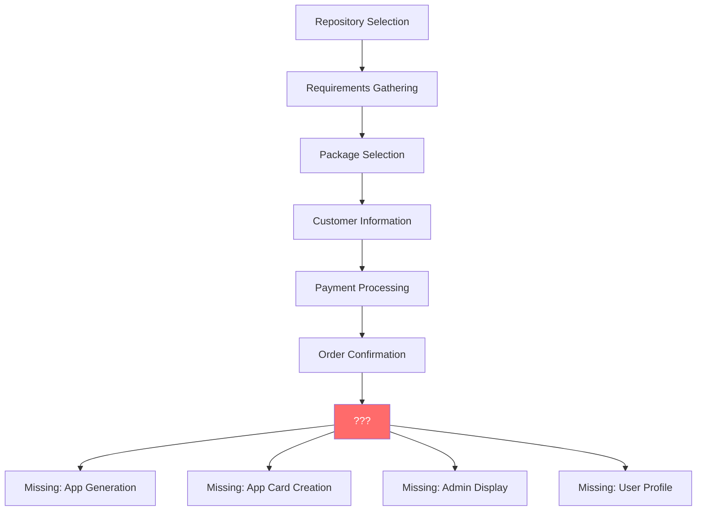
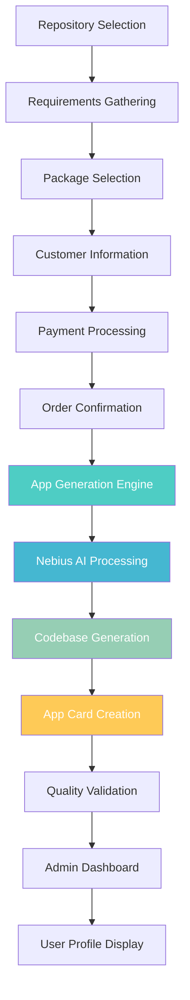

# PATCH 13: App Generation Pipeline Review + Nebius Cloud Integration
## Complete App Generation Stack with Cloud Infrastructure

**Status:** 🔄 **IN PROGRESS**  
**Date:** July 25, 2025  
**Priority:** 🚀 **HIGH** - Production Infrastructure Enhancement

---

## 🎯 **PATCH 13 OBJECTIVES**

### **Primary Goals**
- [ ] **App Generation Pipeline Review** - Audit current codebase generation system
- [ ] **Admin & User Profile Integration** - Display generated app cards
- [ ] **Nebius Cloud Research** - Evaluate AI/ML infrastructure capabilities
- [ ] **Pipeline Optimization** - Streamline app generation workflow
- [ ] **Output Enhancement** - Improve app card generation and display

### **Secondary Goals**
- [ ] **Cloud Infrastructure** - Integrate Nebius AI/ML services
- [ ] **Performance Optimization** - Accelerate generation process
- [ ] **Quality Assurance** - Validate generated app outputs
- [ ] **User Experience** - Seamless generation-to-deployment flow

---

## 🔍 **CURRENT STATE ANALYSIS**

### **App Generation Components to Review**
```typescript
// Existing Generation Components
📁 /components/orders/linear-flow/
  ├── linear-order-flow.tsx          // 6-step generation process
  ├── repository-step.tsx            // GitHub repo selection
  ├── requirements-step.tsx          // App requirements gathering
  ├── package-step.tsx              // Package selection
  ├── customer-step.tsx             // Customer information
  ├── payment-step.tsx              // Payment processing
  └── confirmation-step.tsx         // Generation confirmation

📁 /components/github-mcp/
  ├── github-mcp-client.ts          // Repository analysis
  └── repository-selector.tsx       // Repo selection UI

📁 /app/orders/
  ├── new/page.tsx                  // Order creation
  └── page.tsx                      // Orders overview
```

### **Missing Components to Implement**
```typescript
// Required for Patch 13
📁 /components/app-generation/
  ├── app-generator.tsx             // Core generation engine
  ├── app-card-generator.tsx        // Generated app card creator
  ├── generation-pipeline.tsx       // Complete workflow
  ├── generation-status.tsx         // Real-time progress
  └── nebius-integration.tsx        // Cloud AI/ML services

📁 /components/admin/
  ├── generated-apps-dashboard.tsx  // Admin view of all apps
  ├── app-generation-metrics.tsx    // Analytics & insights
  └── generation-queue.tsx          // Queue management

📁 /components/profile/
  ├── user-generated-apps.tsx       // User's app portfolio
  └── app-card-display.tsx          // Individual app cards
```

---

## 🏗️ **APP GENERATION PIPELINE AUDIT**

### **Current Flow Analysis**


### **Required Pipeline Enhancement**


---

## ☁️ **NEBIUS CLOUD RESEARCH**

### **Nebius Platform Overview**
- **AI/ML Infrastructure:** GPU clusters, model training, inference
- **Cloud Computing:** Scalable compute, storage, networking
- **Developer Tools:** APIs, SDKs, management console
- **Enterprise Features:** Security, compliance, monitoring

### **Potential Integration Points**
```typescript
// Nebius Services for App Generation
interface NebiusIntegration {
  // AI/ML Services
  codeGeneration: {
    model: 'nebius-codegen-pro',
    capabilities: ['fullstack', 'mobile', 'ai/ml', 'blockchain']
  }
  
  // Compute Infrastructure  
  processing: {
    gpuClusters: 'high-performance',
    autoScaling: true,
    spotInstances: true
  }
  
  // Storage & Deployment
  storage: {
    codeRepositories: 'git-based',
    assetStorage: 's3-compatible',
    cdn: 'global-edge-network'
  }
  
  // Monitoring & Analytics
  observability: {
    generationMetrics: true,
    performanceTracking: true,
    costOptimization: true
  }
}
```

---

## 📋 **PATCH 13 IMPLEMENTATION CHECKLIST**

### **Phase 1: Pipeline Audit & Documentation** 🔄
- [ ] **Review Current Linear Order Flow** - Identify gaps
- [ ] **Map Generation Requirements** - Define missing components  
- [ ] **Analyze User Journey** - From order to deployed app
- [ ] **Document Current State** - Baseline assessment
- [ ] **Identify Integration Points** - Where Nebius fits

### **Phase 2: App Generation Engine** ⏳
- [ ] **Create App Generator Component** - Core generation logic
- [ ] **Implement Generation Pipeline** - End-to-end workflow
- [ ] **Add Progress Tracking** - Real-time status updates
- [ ] **Build Error Handling** - Graceful failure management
- [ ] **Create Generation Queue** - Handle multiple requests

### **Phase 3: Nebius Cloud Integration** ⏳
- [ ] **Research Nebius APIs** - Available services and pricing
- [ ] **Create Integration Client** - Nebius service wrapper
- [ ] **Implement AI Code Generation** - Cloud-powered generation
- [ ] **Add GPU Processing** - Accelerated model inference
- [ ] **Setup Cloud Storage** - Generated app repositories

### **Phase 4: App Card Generation** ⏳
- [ ] **Design App Card Schema** - Generated app metadata
- [ ] **Create Card Generator** - Transform apps to cards
- [ ] **Add Trading Card Features** - Battle stats, rarity
- [ ] **Implement Card Display** - UI components
- [ ] **Add Card Management** - CRUD operations

### **Phase 5: Admin & User Integration** ⏳
- [ ] **Build Admin Dashboard** - Generated apps overview
- [ ] **Add Generation Metrics** - Analytics and insights
- [ ] **Create Queue Management** - Admin controls
- [ ] **Implement User Profile** - Personal app portfolio
- [ ] **Add App Card Display** - User's generated apps

### **Phase 6: Testing & Optimization** ⏳
- [ ] **End-to-End Testing** - Complete generation flow
- [ ] **Performance Optimization** - Speed and efficiency
- [ ] **Error Handling Validation** - Robust error management
- [ ] **User Experience Testing** - Smooth workflows
- [ ] **Cloud Integration Testing** - Nebius service reliability

---

## 🎯 **SUCCESS METRICS**

### **Technical Metrics**
- [ ] **Generation Success Rate** - >95% successful completions
- [ ] **Generation Speed** - <5 minutes average time
- [ ] **Code Quality Score** - >85% automated quality assessment
- [ ] **Cloud Integration Reliability** - >99% uptime
- [ ] **User Satisfaction** - >4.5/5 rating

### **Business Metrics**
- [ ] **Generation Volume** - Track daily/weekly generations
- [ ] **Cloud Cost Efficiency** - Optimize Nebius spending
- [ ] **User Retention** - Generation feature adoption
- [ ] **Revenue Impact** - Generated app monetization
- [ ] **Platform Growth** - Increased user engagement

---

## 🚀 **IMPLEMENTATION TIMELINE**

### **Week 1: Research & Planning**
- Complete Nebius platform research
- Audit current app generation pipeline
- Design enhanced generation architecture
- Plan integration strategy

### **Week 2: Core Development**
- Build app generation engine
- Implement pipeline components
- Create progress tracking system
- Add error handling framework

### **Week 3: Cloud Integration**
- Integrate Nebius AI/ML services
- Setup cloud infrastructure
- Implement GPU-accelerated generation
- Add cloud storage and CDN

### **Week 4: UI/UX Development**
- Build admin dashboard components
- Create user profile integration
- Implement app card generation
- Add management interfaces

### **Week 5: Testing & Optimization**
- End-to-end testing
- Performance optimization
- Security validation
- User acceptance testing

---

## 💡 **INNOVATION OPPORTUNITIES**

### **AI-Powered Generation**
- **Smart Code Completion** - Context-aware generation
- **Architecture Optimization** - Best practices enforcement
- **Performance Tuning** - Automated optimization
- **Security Hardening** - Built-in security measures

### **Cloud-Native Features**
- **Auto-scaling Generation** - Handle demand spikes
- **Global Edge Deployment** - Worldwide app distribution
- **Real-time Collaboration** - Multi-user generation
- **Version Control Integration** - Git-based workflows

### **Enhanced User Experience**
- **Visual Generation Builder** - Drag-and-drop interface
- **Template Marketplace** - Pre-built app templates
- **One-click Deployment** - Instant app publishing
- **Analytics Integration** - Generation insights

---

## 📊 **RESOURCE REQUIREMENTS**

### **Development Resources**
- **Frontend Development** - React/TypeScript components
- **Backend Development** - Node.js/Python generation engine
- **Cloud Integration** - Nebius API implementation
- **DevOps** - CI/CD pipeline enhancement
- **Testing** - Automated testing framework

### **Infrastructure Resources**
- **Nebius Cloud Account** - AI/ML services access
- **GPU Compute Credits** - Model training/inference
- **Storage Allocation** - Generated app repositories
- **CDN Bandwidth** - Global content delivery
- **Monitoring Tools** - Performance tracking

---

## 🎉 **EXPECTED OUTCOMES**

### **Technical Achievements**
✅ **Complete App Generation Pipeline** - End-to-end workflow  
✅ **Cloud-Powered AI Generation** - Nebius integration  
✅ **Professional Admin Tools** - Management dashboard  
✅ **Enhanced User Experience** - Seamless generation flow  
✅ **Production-Ready Infrastructure** - Scalable architecture  

### **Business Impact**
✅ **Increased User Engagement** - Powerful generation tools  
✅ **Revenue Growth** - Premium generation features  
✅ **Competitive Advantage** - AI-powered differentiation  
✅ **Platform Expansion** - New market opportunities  
✅ **Technology Leadership** - Cutting-edge infrastructure  

---

*Patch 13 Start Date: July 25, 2025*  
*Estimated Completion: August 25, 2025*  
*Priority Level: HIGH*  
*Status: READY TO BEGIN* 🚀
